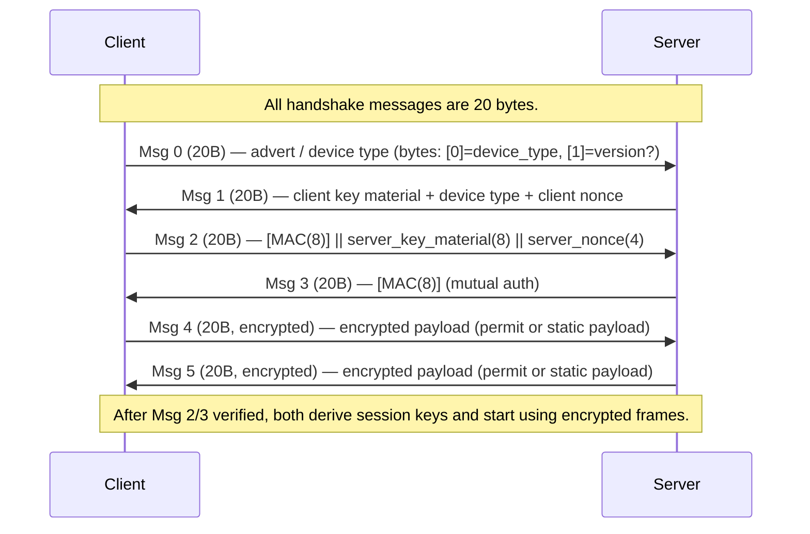

# SAKE protocol documentation

Medtronic uses a custom cryptographic protocol that is implemented over the GATT layer. The protocol consists of a handshake procedure which contains a common Session Key derivation and a Permit Exchange part. After the handshake has been completed, selected GATT traffic is sequenced, encrypted and signed using AES.


## Architecture

Presumably due to the used BT protocol (see more [here](app-services.md)) SAKE consists of a server and a client part. The BT Peripheral is the server and the connecting Central is the client.


## Key databases

The key databases are static between devices and each device type / model. See the detailed description of the format and the actual keys [here](key_databases.md).


## Security properties

- **Pre-shared symmetric keys, not key agreement.** Both sides must already hold identical static keys; the handshake only proves possession. Contrast BLE's own LE Secure Connections pairing, which derives a fresh key between strangers via ECDH.
- **Fleet-wide, not per-device.** Key databases are indexed by *device type*, so every pump of a model — and every copy of the matching app — carries the same bytes. There is no per-device identity and no revocation: a single extraction is permanent and global.
- **No forward secrecy.** The session key is `AES-ECB(derivation_key, server_key_material || client_key_material)`, and both key-material inputs travel in the clear during the handshake. Anyone holding the key database can decrypt a captured session retroactively.

SAKE is therefore a *compatibility gate* — it restricts which device types will talk to a pump — rather than a security boundary. This does not expose pump traffic to a passive sniffer, though: SAKE runs inside BLE's link encryption, whose LTK is never transmitted.


## Initialization

After the successful BLE connection of a SAKE-compatible device, the following steps are necessary to perform a successful handshake:

1. The connecting client subscribes to the server's SAKE characteristic for notifications.
2. The server sends 20 zero bytes as notification for this characteristic.
3. The client responds by writing 20 zero bytes to this characteristic.

This initialization will trigger the actual handshake procedure on both devices. Client and server then go on to exchange the remaining 6 messages defined by the protocol. This also uses the server's SAKE characteristic.


## Handshake procedure

> [!NOTE]
> All messages will be identified by their overall index in the whole process, followed by the sender's first character. So for example message `0_s` is the first message ever during pairing and it is sent by the server.

All handshake messages are 20 bytes long. Random padding bytes are used if the actual content is shorter.

If something goes wrong during the handshake, the protocol is implemented in a way where it will send random garbage, instead of nothing. This is presumably a security feature and als the other side can fail quicker instead of hanging on a timeout.


### 0_s – server announcement

This message just contains the server's device type and probably some version flag.

Byte index | Meaning
-----------|------------
0          | Server device type
1          | Constant 0x01 (probably protocol version)


### 1_c – client keys and type

This message contains the client's randomly generated key material and nonce. It also contains the client device type.

Byte index | Meaning
-----------|------------
0–7        | Client key material
8          | Client device type
9–12       | Client nonce


### 2_s – server key and authentication

This message is the first complex message. The server also generates its key material and nonce, randomly, just like the client. It will perform the key derivation, since it now knows both the client's and its own key material.

Byte index | Meaning
-----------|------------
 0–7       | Server authentication tag
 8–15      | Server key material
16–19      | Server nonce

The server authentication tag is calculated as follows:

```
server_tag = CMAC_AES_8(
  key = DB.handshake_auth_key,
  msg = (server_key_material + client_key_material + DB.derivation_key)
)
```

It uses `handshake_auth_key` and `derivation_key` from the server's pre-shared key database.


### 3_c – client key and authentication

This message contains only the client's authentication tag which the server now uses to verify the authentication message.

Byte index | Meaning
-----------|------------
0–7        | Client authentication tag

The server verifies the authentication message by recomputing its authentication tag the same way the client did:

```
client_tag = CMAC_AES_8(
  key = DB.handshake_auth_key,
  msg = (server_tag + server_key_material + DB.derivation_key)
)
```

Verification is successful if the recomputed client tag is equal to the received one.


### 4_s – server permit

Now, everything has been created in order to have an encrypted session on both sides. So all traffic from now on will be sequenced and SAKE-encrypted.

_TODO: write more about SeqCrypt_

This message is used to establish a "permit" on the remote side (client). It is a signed and encrypted blob that only the remote side can decrypt. Every key database has two keys for exactly this: the `permit_decrypt_key` and `permit_auth_key`.

Byte index | Meaning
-----------|------------
0–15       | Session-encrypted permit

The permit is padded with 1 random byte BEFORE session-level encryption.

```
Session-encrypted permit = (12 bytes of data) + (4 bytes of CMAC)
```

`permit_decrypt_key` can be used to decrypt a permit using AES ECB mode. CMAC is then verified using `permit_auth_key`.

The decrypted permit format is currently not very well understood.  The first byte has to be 0x00, the second has to equal the remote side's (prover) device type.


### 5_c – client permit

The mirror of `4_s`: the client's permit, so both sides prove they hold the pre-shared permit keys. The layout and validation are identical to `4_s`, only the direction differs (the client's SeqCrypt instance decrypts it).

Byte index | Meaning
-----------|------------
0–15       | Session-encrypted permit

The 16-byte payload is decrypted with the client's SeqCrypt instance (`client_crypt`, starting at sequence 0), giving the 16-byte permit plus a trailing random pad byte (discarded). The permit is then decrypted with `permit_decrypt_key` (AES-ECB), its trailing 4-byte CMAC (over the first 12 bytes) verified with `permit_auth_key`, and accepted iff `plain[0] == 0x00` and `plain[1]` equals the prover's (client's) device type. Success completes the handshake; both directions of the SeqCrypt session cipher are now live.

> [!NOTE]
> The full server-role handshake (`0_s`–`5_c`) has been reimplemented independently in C and verified byte-for-byte against OpenMinimed's `780g_pairing_with_mobile` trace and the reference `pysake` implementation.


---

> [!WARNING]
> This is a lazy AI autogenerated documentation from now! dont look at it!

## Overview

- Auth primitives: AES-CMAC and AES-ECB/CTR
- Static keys (stored in a KeyDatabase) contain:
  - `derivation_key` (16 bytes)
  - `handshake_auth_key` (16 bytes)
  - `permit_decrypt_key` (16 bytes)
  - `permit_auth_key` (16 bytes)
  - `handshake_payload` (16 bytes)

The protocol performs a 6-message handshake to authenticate both parties and derive a symmetric session key for AES-CTR payload encryption with a small, embedded MAC scheme.

## High-level message sequence



## Message field details

- Msg0 (checked by `handshake_0_s`): 20 bytes; `msg[1]` expected == 1; `msg[0]` taken as a device type indicator.

- Msg1 (parsed by `handshake_1_c`):
  - `client_key_material` = bytes 0..7 (8B)
  - `client_device_type` = byte 8
  - `client_nonce` = bytes 9..12 (4B)

- Msg2 (parsed by `handshake_2_s`):
  - `received_mac` = bytes 0..7 (8B)
  - `server_key_material` = bytes 8..15 (8B)
  - `server_nonce` = bytes 16..19 (4B)
  - `received_mac` is verified with CMAC-AES-8 over the message `server_key_material || client_key_material || derivation_key` using `handshake_auth_key` (see `auth8`).

- Msg3 (parsed by `handshake_3_c`):
  - Client computes `auth1 = CMAC(handshake_auth_key, msg=(server_key_material||client_key_material||derivation_key))` (8B).
  - `inner = auth1.digest() || server_key_material || derivation_key` (32B)
  - Server's Msg3 contains CMAC-AES-8 over `inner`; client verifies first 8 bytes.

## Key derivation and ciphers

- Once Msg2/Msg3 succeed the code derives the session cipher key:
  - `session_key = AES-ECB(derivation_key).encrypt(server_key_material || client_key_material)` — 16 bytes.
- Nonce material: `nonce = client_nonce || server_nonce` (8 bytes total). SeqCrypt then constructs a per-message CTR nonce as `seq (5 bytes) || nonce (8 bytes)` before left-padding to 16 bytes for CMAC.

## Encrypted frame format (SeqCrypt)

- Each encrypted frame structure (as used in `SeqCrypt.decrypt`) is:
  - `ciphertext || seq_byte || mac_first2bytes`
  - Total trailer size = 3 bytes where:
    - `seq_byte` = transmitted sequence indicator (see sequence math below)
    - `mac_first2bytes` = the first two bytes of a 4-byte CMAC tag

- Verification steps performed on receive:
  1. Compute `d = (msg[-3] - (self.seq // 2)) & 0xFF`
  2. Compute `seq = self.seq + 2*d` and build `nonce = seq.to_bytes(5,'big') || self.nonce`
  3. Compute `c = CMAC-AES-4(key)` over `nonce.ljust(16, b'\0') || ciphertext`
  4. Reconstruct the full 4-byte tag by concatenating `msg[-2:]` (two bytes sent) with `c.digest()[2:4]` (the computed last two bytes), then call `cobj.verify(...)`.
  5. If verification succeeds, set `self.seq = seq + 2` and decrypt `ciphertext` with AES-CTR using `nonce`.

Notes:
- The scheme transmits only the first two bytes of the 4-byte CMAC and reconstructs the trailing two bytes from the computation. This provides a 2-byte on-the-wire tag with a 4-byte internal check.
- Sequence numbering encodes the counter in the single `seq_byte` field as a delta relative to the receiver's `self.seq//2`.

## Permit / payload semantics

- After session keys are set, handshake messages 4 and 5 carry a 16-byte encrypted payload (after decryption):
  - If the decrypted payload equals a device's `handshake_payload` (from static keys), it's logged as a payload match.
  - Otherwise, the receiver attempts to decrypt payload with `permit_decrypt_key` (AES-ECB) to obtain a 16-byte `plain` value with structure:
    - `plain[:12]` = permit data
    - `plain[12:16]` = CMAC-AES-4 tag computed with `permit_auth_key` over `plain[:12]`
    - The code checks `plain[0] == 0` and `plain[1] == prover_device_type` to match device type.

## Implementation notes and observations

- `auth8(...)` builds a CMAC-AES object with `mac_len=8` and uses the `handshake_auth_key` to MAC the concatenation `server_key_material || client_key_material || derivation_key`.
- The session key derivation uses AES-ECB encryption with the 16-byte `derivation_key` of the concatenated 16 bytes `server_key_material||client_key_material` (8+8).
- `SeqCrypt` expects an 8-byte static nonce (client_nonce||server_nonce) and uses a 5-byte sequence counter embedded into the CTR nonce.
- Message trailers are only 3 bytes; the design trades authenticity bandwidth for message size by sending only 2 bytes of the MAC and reconstructing the rest on the verifier side.

